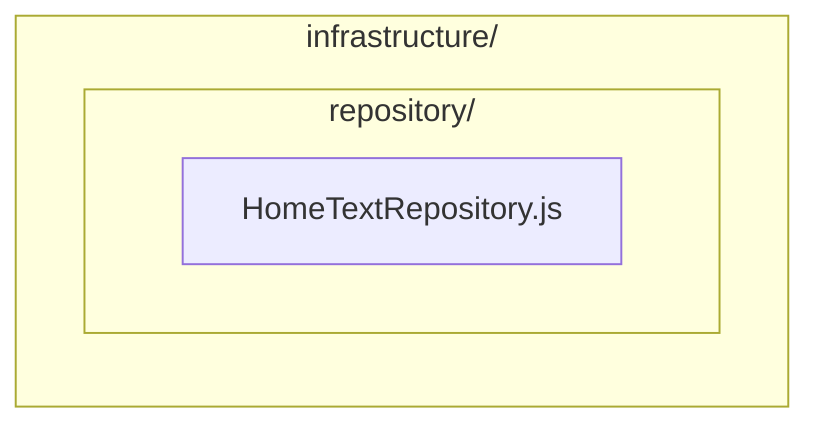
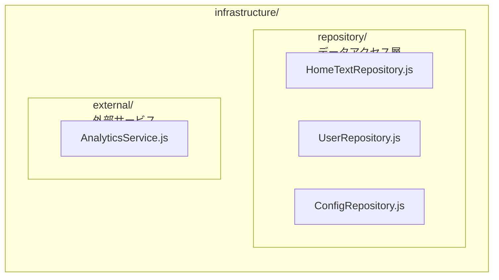

# Infrastructure Layer

インフラストラクチャ層のディレクトリです。外部システムとの連携やデータ永続化の詳細を実装します。

Directory for the Infrastructure layer. Implements details of integration with external systems and data persistence.

## 役割 / Role

Infrastructure層は、アプリケーションの外部とのやり取りを担当します:

The Infrastructure layer is responsible for interactions with the outside of the application:

- ✅ **データアクセス** - API通信、データベースアクセス
- ✅ **外部サービス連携** - サードパーティAPIの呼び出し
- ✅ **永続化の実装** - ストレージへの保存/読み込み
- ✅ **エラーハンドリング** - 外部システムのエラーを適切に処理
- ❌ **ビジネスロジック** - Application/Domain層の責務
- ❌ **UI操作** - View層の責務

## ディレクトリ構造 / Directory Structure



将来的に以下のような拡張も可能です:

Future extensions are possible, such as:



## Repository Pattern

Repositoryパターンは、データアクセスの詳細を抽象化し、Application層から隔離します。

The Repository pattern abstracts data access details and isolates them from the Application layer.

### Repository の特徴 / Repository Characteristics

1. **データソースの抽象化** - APIやDBなどの詳細を隠蔽
2. **統一されたインターフェース** - 一貫したデータアクセス方法
3. **テスタビリティ** - モックに差し替え可能
4. **エラーハンドリング** - 外部システムのエラーを適切に処理

### Example: HomeTextRepository

```javascript
import { config } from "@/config/Config";

/**
 * @description Home画面のテキストデータを管理するRepository
 *              Repository for managing Home screen text data
 *
 * @class
 */
export class HomeTextRepository
{
    /**
     * @description Home画面のテキストデータを取得
     *              Get text data for Home screen
     *
     * @return {Promise<object>}
     * @static
     * @throws {Error} Failed to fetch home text
     */
    static async get ()
    {
        try {
            // APIエンドポイントへリクエスト
            const response = await fetch(
                `${config.api.endPoint}api/home.json`
            );

            // HTTPエラーチェック
            if (!response.ok) {
                throw new Error(
                    `HTTP error! status: ${response.status}`
                );
            }

            // レスポンスをパース
            return await response.json();

        } catch (error) {
            // エラーログ
            console.error('Failed to fetch home text:', error);

            // エラーを上位層に伝播
            throw error;
        }
    }
}
```

## Repository の設計原則 / Repository Design Principles

### 1. エラーハンドリング / Error Handling

すべての外部アクセスでエラーハンドリングを実装します。

Implement error handling for all external access.

```javascript
// ✅ 良い例: 適切なエラーハンドリング
static async get() {
    try {
        const response = await fetch(...);

        if (!response.ok) {
            throw new Error(`HTTP error! status: ${response.status}`);
        }

        return await response.json();
    } catch (error) {
        console.error('Failed to fetch:', error);
        throw error;  // 上位層に伝播
    }
}

// ❌ 悪い例: エラーハンドリングなし
static async get() {
    const response = await fetch(...);  // エラーが握りつぶされる
    return await response.json();
}
```

### 2. 設定の外部化 / Externalize Configuration

エンドポイントなどの設定は `config` から取得します。

Retrieve settings such as endpoints from `config`.

```javascript
// ✅ 良い例: 設定を外部化
static async get() {
    const response = await fetch(
        `${config.api.endPoint}api/data.json`
    );
    return await response.json();
}

// ❌ 悪い例: ハードコーディング
static async get() {
    const response = await fetch(
        'https://example.com/api/data.json'  // NG
    );
    return await response.json();
}
```

### 3. 静的メソッド vs インスタンスメソッド / Static vs Instance Methods

シンプルな場合は静的メソッド、状態を持つ場合はインスタンスメソッドを使用します。

Use static methods for simple cases, instance methods when holding state.

```javascript
// ✅ 静的メソッド: ステートレスな場合
export class SimpleRepository {
    static async get(id) {
        const response = await fetch(`/api/${id}`);
        return await response.json();
    }
}

// ✅ インスタンスメソッド: 状態を持つ場合
export class CachedRepository {
    constructor() {
        this.cache = new Map();
    }

    async get(id) {
        if (this.cache.has(id)) {
            return this.cache.get(id);
        }

        const response = await fetch(`/api/${id}`);
        const data = await response.json();
        this.cache.set(id, data);

        return data;
    }
}
```

## 高度なエラーハンドリング / Advanced Error Handling

### リトライ機能 / Retry Functionality

```javascript
export class RobustRepository {
    static MAX_RETRIES = 3;
    static RETRY_DELAY = 1000;

    static async get(id) {
        let lastError = null;

        for (let i = 0; i < this.MAX_RETRIES; i++) {
            try {
                const response = await fetch(`/api/${id}`);

                if (!response.ok) {
                    throw new Error(`HTTP ${response.status}`);
                }

                return await response.json();
            } catch (error) {
                lastError = error;
                console.warn(`Retry ${i + 1}/${this.MAX_RETRIES}:`, error);

                if (i < this.MAX_RETRIES - 1) {
                    await this.sleep(this.RETRY_DELAY);
                }
            }
        }

        throw new Error(`Failed after ${this.MAX_RETRIES} retries: ${lastError}`);
    }

    static sleep(ms) {
        return new Promise(resolve => setTimeout(resolve, ms));
    }
}
```

### タイムアウト処理 / Timeout Handling

```javascript
export class TimeoutRepository {
    static TIMEOUT = 5000;  // 5秒

    static async get(id) {
        const controller = new AbortController();
        const timeoutId = setTimeout(
            () => controller.abort(),
            this.TIMEOUT
        );

        try {
            const response = await fetch(`/api/${id}`, {
                signal: controller.signal
            });

            clearTimeout(timeoutId);

            if (!response.ok) {
                throw new Error(`HTTP ${response.status}`);
            }

            return await response.json();
        } catch (error) {
            clearTimeout(timeoutId);

            if (error.name === 'AbortError') {
                throw new Error(`Request timeout after ${this.TIMEOUT}ms`);
            }

            throw error;
        }
    }
}
```

## キャッシング戦略 / Caching Strategy

### メモリキャッシュ / Memory Cache

```javascript
export class CachedRepository {
    static cache = new Map();
    static CACHE_TTL = 60000;  // 1分

    static async get(id) {
        // キャッシュチェック
        const cached = this.cache.get(id);
        const now = Date.now();

        if (cached && (now - cached.timestamp) < this.CACHE_TTL) {
            console.log('Cache hit:', id);
            return cached.data;
        }

        // APIから取得
        console.log('Cache miss:', id);
        const response = await fetch(`/api/${id}`);
        const data = await response.json();

        // キャッシュに保存
        this.cache.set(id, {
            data,
            timestamp: now
        });

        return data;
    }

    static clearCache() {
        this.cache.clear();
    }
}
```

## モック実装 / Mock Implementation

テスト用のモックRepositoryを作成できます。

You can create mock Repositories for testing.

```javascript
// テスト用モック
export class MockHomeTextRepository {
    static async get() {
        // モックデータを返す
        return {
            word: 'Mock Data'
        };
    }
}

// テストコード
import { MockHomeTextRepository } from './MockHomeTextRepository';

describe('HomeViewModel', () => {
    test('should display mock data', async () => {
        // Repositoryをモックに差し替え
        const data = await MockHomeTextRepository.get();
        expect(data.word).toBe('Mock Data');
    });
});
```

## 新しいRepositoryの作成 / Creating New Repositories

### 手順 / Steps

1. **Repositoryクラスを作成** - `infrastructure/repository/` に配置
2. **エラーハンドリング実装** - try-catchで適切に処理
3. **UseCaseから使用** - Application層で呼び出し

### テンプレート / Template

```javascript
import { config } from "@/config/Config";

/**
 * @description [Repositoryの説明]
 *              [Repository description]
 *
 * @class
 */
export class YourRepository
{
    /**
     * @description [処理の説明]
     *              [Process description]
     *
     * @param  {string} id
     * @return {Promise<object>}
     * @static
     * @throws {Error} [エラーの説明]
     */
    static async get (id)
    {
        try {
            const response = await fetch(
                `${config.api.endPoint}api/your-endpoint/${id}`
            );

            if (!response.ok) {
                throw new Error(
                    `HTTP error! status: ${response.status}`
                );
            }

            return await response.json();

        } catch (error) {
            console.error('Failed to fetch data:', error);
            throw error;
        }
    }
}
```

## ベストプラクティス / Best Practices

1. **エラーハンドリング** - すべての外部アクセスでtry-catchを実装
2. **設定の外部化** - エンドポイントなどは `config` から取得
3. **ログ出力** - エラー時は詳細なログを出力
4. **単一責任** - 1つのRepositoryは1つのデータソースを担当

## 関連ドキュメント / Related Documentation

- [ARCHITECTURE.md](../../../ARCHITECTURE.md) - アーキテクチャ全体の説明
- [../application/README.md](../application/README.md) - Application層の説明
- [../../config/README.md](../../config/README.md) - 設定ファイル
