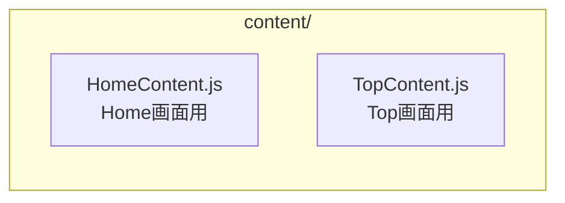

# Animation Tool Content

Next2D Animation Toolで作成されたコンテンツを格納するディレクトリです。

Directory for storing content created with the Next2D Animation Tool.

## 概要 / Overview

Animation Toolで作成したアニメーションをJavaScriptクラスとしてラップし、アプリケーションで使用できるようにします。

Wraps animations created with the Animation Tool as JavaScript classes for use in the application.

## ディレクトリ構造 / Directory Structure



## コンテンツの仕組み / How Content Works

### 1. Animation Toolでn2dファイルを作成

Animation Toolでアニメーションを作成し、`.n2d` ファイルとしてエクスポートします。エクスポートしたファイルは `file/` ディレクトリに配置します。

Create animations in the Animation Tool and export as `.n2d` files. Place exported files in the `file/` directory.

### 2. JavaScriptクラスでラップ

`.n2d` ファイル内のシンボルをJavaScriptクラスとして定義します。

Define symbols from `.n2d` files as JavaScript classes.

### 3. コンポーネントで使用

作成したContentクラスをMoleculeなどのコンポーネントで使用します。

Use the created Content classes in components such as Molecules.

## 実装例 / Implementation Example

### HomeContent.js

```javascript
import { MovieClipContent } from "@next2d/framework";

/**
 * @description Home画面用のアニメーションコンテンツ
 *              Animation content for Home screen
 *
 * @class
 * @extends {MovieClipContent}
 */
export class HomeContent extends MovieClipContent
{
    /**
     * @description Animation Toolのシンボル名を返す
     *              Returns the Animation Tool symbol name
     *
     * @return {string}
     * @readonly
     */
    get namespace ()
    {
        return "HomeContent";  // Animation Toolで設定したシンボル名
    }

    /**
     * @description ドラッグを開始
     *              Start dragging
     */
    startDrag ()
    {
        // ドラッグ処理
    }

    /**
     * @description ドラッグを停止
     *              Stop dragging
     */
    stopDrag ()
    {
        // ドラッグ停止処理
    }
}
```

### TopContent.js

```javascript
import { MovieClipContent } from "@next2d/framework";

/**
 * @description Top画面用のアニメーションコンテンツ
 *              Animation content for Top screen
 *
 * @class
 * @extends {MovieClipContent}
 */
export class TopContent extends MovieClipContent
{
    /**
     * @description Animation Toolのシンボル名を返す
     *              Returns the Animation Tool symbol name
     *
     * @return {string}
     * @readonly
     */
    get namespace ()
    {
        return "TopContent";
    }
}
```

## 設計原則 / Design Principles

### 1. MovieClipContentの継承 / Extend MovieClipContent

すべてのコンテンツクラスは `MovieClipContent` を継承します。

All content classes extend `MovieClipContent`.

```javascript
import { MovieClipContent } from "@next2d/framework";

export class YourContent extends MovieClipContent {
    get namespace() {
        return "YourSymbolName";
    }
}
```

### 2. namespaceプロパティ / namespace Property

`namespace` ゲッターでAnimation Toolで設定したシンボル名を返します。

Return the symbol name set in the Animation Tool with the `namespace` getter.

```javascript
get namespace() {
    return "HomeContent";  // Animation Toolのシンボル名と一致させる
}
```

## 新しいContentの追加 / Adding New Content

### 手順 / Steps

1. Animation Toolでシンボルを作成
2. `.n2d` ファイルを `file/` ディレクトリに配置
3. Contentクラスを作成（`namespace` はシンボル名と一致させる）
4. Moleculeなどのコンポーネントで使用

### テンプレート / Template

```javascript
import { MovieClipContent } from "@next2d/framework";

/**
 * @description [コンテンツの説明]
 *              [Content description]
 *
 * @class
 * @extends {MovieClipContent}
 */
export class YourContent extends MovieClipContent
{
    /**
     * @description Animation Toolのシンボル名を返す
     *              Returns the Animation Tool symbol name
     *
     * @return {string}
     * @readonly
     */
    get namespace ()
    {
        return "YourSymbolName";  // Animation Toolで設定した名前
    }
}
```

## ベストプラクティス / Best Practices

1. **命名規則** - クラス名とシンボル名を一致させる
2. **責務の分離** - アニメーションの制御のみを担当
3. **ドキュメント** - シンボル名をJSDocに記載

## 関連ドキュメント / Related Documentation

- [../../file/README.md](../../../file/README.md) - n2dファイルの格納場所
- [../component/README.md](../component/README.md) - UIコンポーネント
- [../README.md](../README.md) - UI全体の説明
- [Next2D Animation Tool](https://tool.next2d.app/) - Animation Toolの使い方
