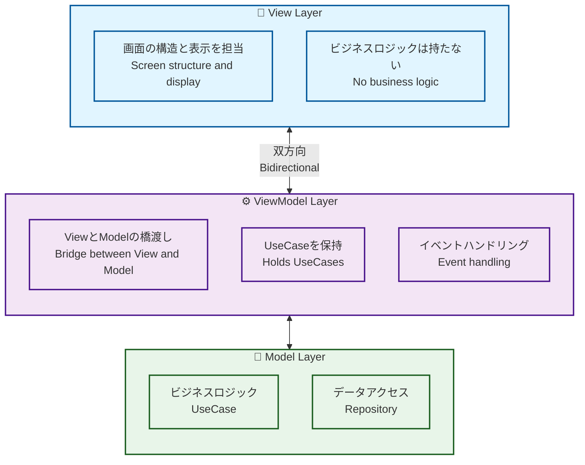
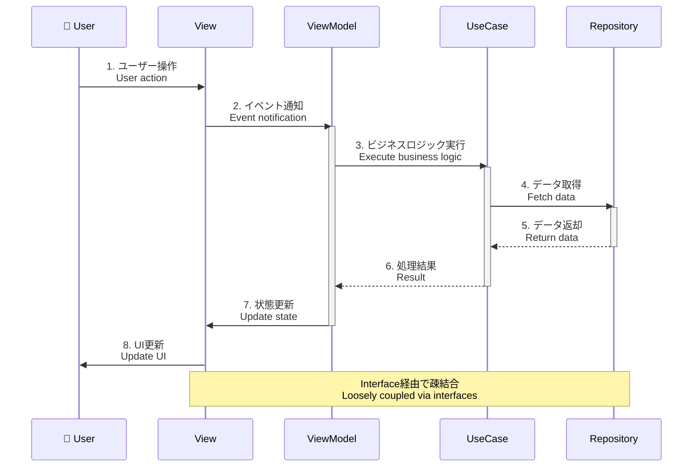
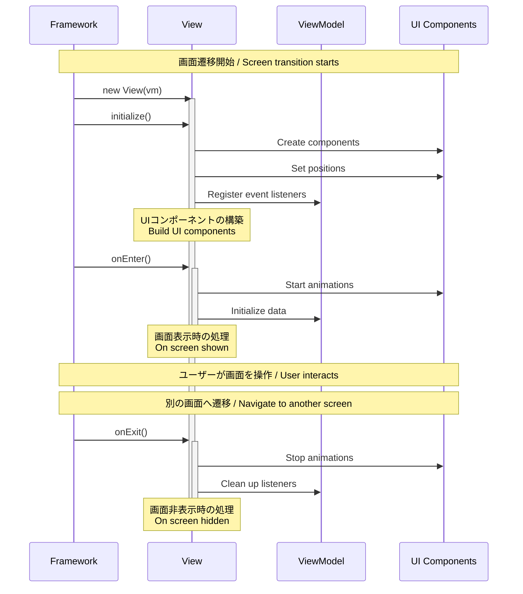

# View and ViewModel

1画面にViewとViewModelをワンセット作成するのが基本スタイルです。ディレクトリ構成はキャメルケースの最初のブロックで作成するのを推奨しています。

The basic style is to create one set of View and ViewModel per screen. It is recommended that the directory structure be organized using the first segment in camelCase.

## アーキテクチャ / Architecture

このプロジェクトは **MVVM (Model-View-ViewModel)** パターンを採用しています。

This project adopts the **MVVM (Model-View-ViewModel)** pattern.



### MVVMパターンの流れ / MVVM Pattern Flow



## Example of directory structure

```
src/
└── view/
    ├── top/
    │   ├── TopView.js
    │   └── TopViewModel.js
    └── home/
        ├── HomeView.js
        └── HomeViewModel.js
```

## Generator

複数のViewクラス、及び、ViewModelクラスを生成する際は、以下のコマンドで自動生成する事をお勧めします。このコマンドは `routing.json` のトッププロパティの値を分解し、`view` ディレクトリ直下に対象のディレクトリがなければディレクトリを作成し、ViewとViewModelが存在しない場合のみ新規でクラスを生成します。

When generating multiple View and ViewModel classes, it is recommended to use the following command for auto-generation. This command parses the top-level property values in `routing.json`, creates the target directories under the `view` directory if they do not exist, and generates new classes only if the corresponding View and ViewModel classes are missing.

```sh
npm run generate
```

## View Class

メインコンテキストにアタッチされるコンテナです。その為、記述は至ってシンプルで、 `routing.json` で設定した値のキャメルケースでファイルを作成し、Viewクラスを継承するのが基本のスタイルです。起動時に `initialize` 関数がコールされます。Viewは表示構造のみを担当し、ビジネスロジックはViewModelに委譲します。

It is a container attached to the main context. Therefore, its implementation is kept very simple: files are created using the camelCase version of the values specified in `routing.json`, and the basic style is to extend the View class. The `initialize` function is called at startup. The View handles only the display structure and delegates business logic to the ViewModel.

### View の責務 / View Responsibilities

- ✅ **画面の構造定義** - UIコンポーネントの配置と座標設定
- ✅ **イベントリスナーの登録** - ViewModelのメソッドと接続
- ✅ **ライフサイクル管理** - `initialize`, `onEnter`, `onExit`
- ❌ **ビジネスロジック** - ViewModelに委譲
- ❌ **データアクセス** - Repositoryに委譲

### ライフサイクル / Lifecycle

Viewには3つの主要なライフサイクルメソッドがあります。各メソッドは特定のタイミングで自動的に呼び出されます。

Views have three main lifecycle methods. Each method is automatically called at a specific timing.



#### 1. initialize() - 初期化

**呼び出しタイミング / When Called:**
- Viewのインスタンスが生成された直後、画面が表示される前

**主な用途 / Primary Usage:**
- ✅ UIコンポーネントの生成と配置
- ✅ イベントリスナーの登録
- ✅ 子要素の追加（`addChild`）

#### 2. onEnter() - 画面表示時

**主な用途 / Primary Usage:**
- ✅ 入場アニメーションの開始
- ✅ データの取得・更新
- ✅ タイマーやインターバルの開始

#### 3. onExit() - 画面非表示時

**主な用途 / Primary Usage:**
- ✅ アニメーションの停止
- ✅ タイマーやインターバルのクリア
- ✅ リソースの解放

### Example of View class source

```javascript
import { View } from "@next2d/framework";
import { HomeBtnMolecule } from "@/ui/component/molecule/HomeBtnMolecule";
import { TextAtom } from "@/ui/component/atom/TextAtom";
import { PointerEvent, Event } from "@next2d/events";

export class HomeView extends View
{
    constructor (vm) {
        super();
        this.vm = vm;
    }

    async initialize ()
    {
        // UIコンポーネントの作成と配置
        const homeContent = new HomeBtnMolecule();
        homeContent.x = 120;
        homeContent.y = 120;

        // イベントをViewModelに委譲
        homeContent.addEventListener(
            PointerEvent.POINTER_DOWN,
            this.vm.homeContentPointerDownEvent.bind(this.vm)
        );

        this.addChild(homeContent);
    }

    async onEnter ()
    {
        // 画面表示時の処理
    }

    async onExit ()
    {
        // 画面非表示時の処理
    }
}
```

## ViewModel Class

ViewとModelの橋渡しを行います。UseCaseを保持し、Viewからのイベントを処理してビジネスロジックを実行します。

Acts as a bridge between View and Model. Holds UseCases and processes events from View to execute business logic.

### ViewModel の責務 / ViewModel Responsibilities

- ✅ **イベント処理** - Viewからのイベントを受け取る
- ✅ **UseCaseの実行** - ビジネスロジックを呼び出す
- ✅ **依存性の管理** - UseCaseのインスタンスを保持
- ❌ **UI操作** - Viewに委譲

### Example of ViewModel class source

```javascript
import { ViewModel, app } from "@next2d/framework";
import { StartDragUseCase } from "@/model/application/home/usecase/StartDragUseCase";
import { StopDragUseCase } from "@/model/application/home/usecase/StopDragUseCase";

export class HomeViewModel extends ViewModel
{
    constructor ()
    {
        super();
        this.startDragUseCase = new StartDragUseCase();
        this.stopDragUseCase = new StopDragUseCase();
        this.homeText = "";
    }

    async initialize ()
    {
        const response = app.getResponse();
        this.homeText = response.has("HomeText") ? response.get("HomeText").word : "";
    }

    getHomeText ()
    {
        return this.homeText;
    }

    homeContentPointerDownEvent (event)
    {
        const target = event.currentTarget;
        this.startDragUseCase.execute(target);
    }

    homeContentPointerUpEvent (event)
    {
        const target = event.currentTarget;
        this.stopDragUseCase.execute(target);
    }
}
```

## 設計原則 / Design Principles

### 1. 関心の分離 / Separation of Concerns

```javascript
// ✅ 良い例: Viewは表示のみ、ViewModelはロジック
class HomeView extends View {
    async initialize() {
        // UI構築のみ
        const btn = new HomeBtnMolecule();
        btn.addEventListener(PointerEvent.POINTER_DOWN, this.vm.onClick.bind(this.vm));
    }
}
```

### 2. ViewとViewModelは1対1

1つのViewに対して1つのViewModelを作成します。

Create one ViewModel for each View.

### 3. イベントは必ずViewModelに委譲

View内でイベント処理を完結させず、必ずViewModelに委譲します。

Never handle events entirely within View; always delegate to ViewModel.

## 関連ドキュメント / Related Documentation

- [ARCHITECTURE.md](../../ARCHITECTURE.md) - アーキテクチャ全体の説明
- [model/README.md](../model/README.md) - Model層の説明
- [ui/README.md](../ui/README.md) - UIコンポーネント
- [config/README.md](../config/README.md) - ルーティング設定
