# View and ViewModel

1画面にViewとViewModelをワンセット作成するのが基本スタイルです。ディレクトリ構成はキャメルケースの最初のブロックで作成するのを推奨しています。

The basic style is to create one set of View and ViewModel per screen. It is recommended that the directory structure be organized using the first segment in camelCase.

## アーキテクチャ / Architecture

このプロジェクトは **MVVM (Model-View-ViewModel)** パターンを採用しています。

This project adopts the **MVVM (Model-View-ViewModel)** pattern.

```mermaid
graph TB
    subgraph ViewLayer["🎨 View Layer"]
        direction TB
        ViewRole["画面の構造と表示を担当<br/>Screen structure and display"]
        ViewRule["ビジネスロジックは持たない<br/>No business logic"]
    end

    subgraph ViewModelLayer["⚙️ ViewModel Layer"]
        direction TB
        VMRole1["ViewとModelの橋渡し<br/>Bridge between View and Model"]
        VMRole2["UseCaseを保持<br/>Holds UseCases"]
        VMRole3["イベントハンドリング<br/>Event handling"]
    end

    subgraph ModelLayer["💎 Model Layer"]
        direction TB
        ModelRole1["ビジネスロジック<br/>UseCase"]
        ModelRole2["データアクセス<br/>Repository"]
    end

    ViewLayer <-->|双方向<br/>Bidirectional| ViewModelLayer
    ViewModelLayer <--> ModelLayer

    classDef viewStyle fill:#e1f5ff,stroke:#01579b,stroke-width:2px
    classDef vmStyle fill:#f3e5f5,stroke:#4a148c,stroke-width:2px
    classDef modelStyle fill:#e8f5e9,stroke:#1b5e20,stroke-width:2px

    class ViewLayer,ViewRole,ViewRule viewStyle
    class ViewModelLayer,VMRole1,VMRole2,VMRole3 vmStyle
    class ModelLayer,ModelRole1,ModelRole2 modelStyle
```



### MVVMパターンの流れ / MVVM Pattern Flow

```mermaid
sequenceDiagram
    participant User as 👤 User
    participant View as View
    participant VM as ViewModel
    participant UC as UseCase
    participant Repo as Repository

    User->>View: 1. ユーザー操作<br/>User action
    View->>VM: 2. イベント通知<br/>Event notification
    activate VM
    VM->>UC: 3. ビジネスロジック実行<br/>Execute business logic
    activate UC
    UC->>Repo: 4. データ取得<br/>Fetch data
    activate Repo
    Repo-->>UC: 5. データ返却<br/>Return data
    deactivate Repo
    UC-->>VM: 6. 処理結果<br/>Result
    deactivate UC
    VM->>View: 7. 状態更新<br/>Update state
    deactivate VM
    View->>User: 8. UI更新<br/>Update UI
```



## Example of directory structure

```
src/
└── view/
    ├── top/
    │   ├── TopView.js
    │   └── TopViewModel.js
    └── home/
        ├── HomeView.js
        └── HomeViewModel.js
```

## Generator

複数のViewクラス、及び、ViewModelクラスを生成する際は、以下のコマンドで自動生成する事をお勧めします。このコマンドは `routing.json` のトッププロパティの値を分解し、`view` ディレクトリ直下に対象のディレクトリがなければディレクトリを作成し、ViewとViewModelが存在しない場合のみ新規でクラスを生成します。

When generating multiple View and ViewModel classes, it is recommended to use the following command for auto-generation. This command parses the top-level property values in `routing.json`, creates the target directories under the `view` directory if they do not exist, and generates new classes only if the corresponding View and ViewModel classes are missing.

```sh
npm run generate
```

## View Class

メインコンテキストにアタッチされるコンテナです。その為、記述は至ってシンプルで、 `routing.json` で設定した値のキャメルケースでファイルを作成し、Viewクラスを継承するのが基本のスタイルです。起動時に `initialize` 関数がコールされます。Viewは表示構造のみを担当し、ビジネスロジックはViewModelに委譲します。

It is a container attached to the main context. Therefore, its implementation is kept very simple: files are created using the camelCase version of the values specified in `routing.json`, and the basic style is to extend the View class. The `initialize` function is called at startup. The View handles only the display structure and delegates business logic to the ViewModel.

### View の責務 / View Responsibilities

- ✅ **画面の構造定義** - UIコンポーネントの配置と座標設定
- ✅ **イベントリスナーの登録** - ViewModelのメソッドと接続
- ✅ **ライフサイクル管理** - `initialize`, `onEnter`, `onExit`
- ❌ **ビジネスロジック** - ViewModelに委譲
- ❌ **データアクセス** - Repositoryに委譲
- ❌ **状態管理** - ViewModelに委譲

### ライフサイクル / Lifecycle

Viewには3つの主要なライフサイクルメソッドがあります。各メソッドは特定のタイミングで自動的に呼び出されます。

Views have three main lifecycle methods. Each method is automatically called at a specific timing.

#### 1. initialize() - 初期化

**呼び出しタイミング / When Called:**
- Viewのインスタンスが生成された直後、画面が表示される前
- 画面遷移時に1回だけ呼び出される
- `onEnter()` より前に実行される

**主な用途 / Primary Usage:**
- ✅ UIコンポーネントの生成と配置
- ✅ イベントリスナーの登録
- ✅ 子要素の追加（`addChild`）
- ✅ 初期レイアウトの設定

#### 2. onEnter() - 画面表示時

**呼び出しタイミング / When Called:**
- `initialize()` の実行完了後
- 画面が実際に表示される直前
- 画面遷移のたびに毎回呼び出される

**主な用途 / Primary Usage:**
- ✅ 入場アニメーションの開始
- ✅ データの取得・更新
- ✅ タイマーやインターバルの開始

#### 3. onExit() - 画面非表示時

**呼び出しタイミング / When Called:**
- 別の画面に遷移する直前
- 画面が非表示になる時

**主な用途 / Primary Usage:**
- ✅ アニメーションの停止
- ✅ タイマーやインターバルのクリア
- ✅ リソースの解放

### Example of View class source

```javascript
import { View } from "@next2d/framework";
import { HomeBtnMolecule } from "@/ui/component/molecule/HomeBtnMolecule";
import { TextAtom } from "@/ui/component/atom/TextAtom";
import { PointerEvent } from "@next2d/events";

/**
 * @class
 * @extends {View}
 */
export class HomeView extends View
{
    /**
     * @param {HomeViewModel} vm
     * @constructor
     * @public
     */
    constructor (vm) {
        super();
        this.vm = vm;
        this.autoSlideTimer = null;
        this.isActive = false;
    }

    /**
     * @description 画面の初期化 - UIコンポーネントの構築
     *              Initialize - Build UI components
     *
     * @return {Promise<void>}
     * @method
     * @override
     * @public
     */
    async initialize ()
    {
        // UIコンポーネントの作成と配置
        const homeContent = new HomeBtnMolecule();
        homeContent.x = 120;
        homeContent.y = 120;
        homeContent.name = "homeContent";

        // イベントをViewModelに委譲
        homeContent.addEventListener(
            PointerEvent.POINTER_DOWN,
            this.vm.homeContentPointerDownEvent.bind(this.vm)
        );

        this.addChild(homeContent);
    }

    /**
     * @description 画面表示時の処理 - アニメーション開始、データ取得
     *              On screen shown - Start animations, fetch data
     *
     * @return {Promise<void>}
     * @method
     * @override
     * @public
     */
    async onEnter ()
    {
        // データ取得（ViewModelに委譲）
        await this.vm.initialize();

        // アクティブ状態に設定
        this.isActive = true;
    }

    /**
     * @description 画面非表示時の処理 - クリーンアップ
     *              On screen hidden - Clean up resources
     *
     * @return {Promise<void>}
     * @method
     * @override
     * @public
     */
    async onExit ()
    {
        // タイマーのクリア
        if (this.autoSlideTimer) {
            clearInterval(this.autoSlideTimer);
            this.autoSlideTimer = null;
        }

        // 非アクティブ状態に設定
        this.isActive = false;
    }
}
```

## ViewModel Class

ViewとModelの橋渡しを行います。UseCaseを保持し、Viewからのイベントを処理してビジネスロジックを実行します。ViewModelは依存性注入パターンを使用し、コンストラクタでUseCaseのインスタンスを生成します。

Acts as a bridge between View and Model. Holds UseCases and processes events from View to execute business logic. ViewModel uses the dependency injection pattern, creating UseCase instances in the constructor.

### ViewModel の責務 / ViewModel Responsibilities

- ✅ **イベント処理** - Viewからのイベントを受け取る
- ✅ **UseCaseの実行** - ビジネスロジックを呼び出す
- ✅ **依存性の管理** - UseCaseのインスタンスを保持
- ✅ **状態管理** - 画面固有の状態を管理（必要に応じて）
- ❌ **UI操作** - Viewに委譲
- ❌ **ビジネスロジック** - UseCaseに委譲

### ライフサイクル / Lifecycle

ViewModelには主要なライフサイクルメソッドがあります。重要なのは、**ViewModelの`initialize()`はViewの`initialize()`より前に呼び出される**という点です。

ViewModel has key lifecycle methods. Importantly, **ViewModel's `initialize()` is called before View's `initialize()`**.

#### 実行順序 / Execution Order

```
1. ViewModel のインスタンス生成
   ↓
2. ViewModel.initialize() ⭐ ViewModelが先
   ↓
3. View のインスタンス生成（ViewModelを注入）
   ↓
4. View.initialize()
   ↓
5. View.onEnter()
   ↓
   （ユーザー操作）
   ↓
6. View.onExit()
```

### Example of ViewModel class source

```javascript
import { ViewModel } from "@next2d/framework";
import { StartDragUseCase } from "@/model/application/home/usecase/StartDragUseCase";
import { StopDragUseCase } from "@/model/application/home/usecase/StopDragUseCase";
import { CenterTextFieldUseCase } from "@/model/application/home/usecase/CenterTextFieldUseCase";
import { HomeTextRepository } from "@/model/infrastructure/repository/HomeTextRepository";

/**
 * @class
 * @extends {ViewModel}
 */
export class HomeViewModel extends ViewModel
{
    /**
     * @description ViewModelの初期化とUseCaseの注入
     *              Initialize ViewModel and inject UseCases
     *
     * @constructor
     * @public
     */
    constructor ()
    {
        super();
        
        // UseCaseのインスタンスを生成
        this.startDragUseCase = new StartDragUseCase();
        this.stopDragUseCase = new StopDragUseCase();
        this.centerTextFieldUseCase = new CenterTextFieldUseCase();
        
        // 画面の状態管理
        this.homeText = "";
        this.isLoading = true;
    }

    /**
     * @description ViewModelの初期化 - データ取得と状態準備
     *              Initialize ViewModel - Fetch data and prepare state
     *              ⭐ Viewのinitialize()より前に呼ばれる
     *
     * @return {Promise<void>}
     * @method
     * @override
     * @public
     */
    async initialize ()
    {
        // 初期データの取得（Viewが表示される前に完了）
        try {
            const data = await HomeTextRepository.get();
            this.homeText = data.word;
            this.isLoading = false;
        } catch (error) {
            console.error('Failed to fetch home text:', error);
            this.homeText = 'Hello, World!';
            this.isLoading = false;
        }
    }

    /**
     * @description 取得したテキストを返す
     *              Return fetched text
     *
     * @return {string}
     * @method
     * @public
     */
    getHomeText ()
    {
        return this.homeText;
    }

    /**
     * @description ドラッグ開始イベントのハンドラ
     *              Handler for drag start event
     *
     * @param  {PointerEvent} event
     * @return {void}
     * @method
     * @public
     */
    homeContentPointerDownEvent (event)
    {
        // ターゲットを取得
        const target = event.currentTarget;
        
        // UseCaseを実行
        this.startDragUseCase.execute(target);
    }

    /**
     * @description ドラッグ停止イベントのハンドラ
     *              Handler for drag stop event
     *
     * @param  {PointerEvent} event
     * @return {void}
     * @method
     * @public
     */
    homeContentPointerUpEvent (event)
    {
        const target = event.currentTarget;
        this.stopDragUseCase.execute(target);
    }
}
```

## 設計原則 / Design Principles

### 1. 関心の分離 / Separation of Concerns

```javascript
// ✅ 良い例: Viewは表示のみ、ViewModelはロジック
class HomeView extends View {
    async initialize() {
        // UI構築のみ
        const btn = new HomeBtnMolecule();
        btn.addEventListener(PointerEvent.POINTER_DOWN, this.vm.onClick.bind(this.vm));
    }
}

class HomeViewModel extends ViewModel {
    onClick(event) {
        // ビジネスロジック実行
        this.someUseCase.execute();
    }
}

// ❌ 悪い例: Viewにビジネスロジック
class HomeView extends View {
    async initialize() {
        const btn = new HomeBtnMolecule();
        btn.addEventListener(PointerEvent.POINTER_DOWN, async () => {
            // NG: Viewでビジネスロジック実行
            const data = await Repository.get();
            this.processData(data);
        });
    }
}
```

### 2. テスタビリティ / Testability

UseCaseをモックに差し替えることで、ViewModelを独立してテスト可能です。

ViewModel can be tested independently by replacing UseCases with mocks.

```javascript
describe('HomeViewModel', () => {
    test('should call UseCase when event is triggered', () => {
        // モックUseCaseを作成
        const mockUseCase = {
            execute: jest.fn()
        };

        // ViewModelにモックを注入
        const vm = new HomeViewModel();
        vm.startDragUseCase = mockUseCase;

        // イベント発火
        const mockEvent = { currentTarget: mockDraggable };
        vm.homeContentPointerDownEvent(mockEvent);

        // UseCaseが呼ばれたか検証
        expect(mockUseCase.execute).toHaveBeenCalled();
    });
});
```

## ベストプラクティス / Best Practices

### 1. ViewとViewModelは1対1

1つのViewに対して1つのViewModelを作成します。

Create one ViewModel for each View.

### 2. Viewはステートレス

Viewは状態を持たず、ViewModelから渡されたデータを表示するだけです。

View is stateless and only displays data passed from ViewModel.

### 3. イベントは必ずViewModelに委譲

View内でイベント処理を完結させず、必ずViewModelに委譲します。

Never handle events entirely within View; always delegate to ViewModel.

## 新しいView/ViewModelの作成 / Creating New View/ViewModel

### 手順 / Steps

1. **routing.jsonに追加** - 新しいルートを定義
2. **自動生成** - `npm run generate` を実行
3. **ViewModelにUseCaseを追加** - コンストラクタで依存性注入
4. **Viewに表示ロジック追加** - UIコンポーネントの配置
5. **イベント連携** - ViewからViewModelのメソッドを呼び出し

### テンプレート / Template

```javascript
// YourView.js
import { View } from "@next2d/framework";

export class YourView extends View {
    /**
     * @param {YourViewModel} vm
     */
    constructor(vm) {
        super();
        this.vm = vm;
    }

    async initialize() {
        // UIコンポーネントの作成と配置
    }

    async onEnter() {
        // 画面表示時の処理
    }

    async onExit() {
        // 画面非表示時の処理
    }
}

// YourViewModel.js
import { ViewModel } from "@next2d/framework";
import { YourUseCase } from "@/model/application/your/usecase/YourUseCase";

export class YourViewModel extends ViewModel {
    constructor() {
        super();
        this.yourUseCase = new YourUseCase();
    }

    async initialize() {
        return void 0;
    }

    yourEventHandler(event) {
        this.yourUseCase.execute();
    }
}
```

## 関連ドキュメント / Related Documentation

- [ARCHITECTURE.md](../../ARCHITECTURE.md) - アーキテクチャ全体の説明
- [model/README.md](../model/README.md) - Model層の説明
- [ui/README.md](../ui/README.md) - UIコンポーネント
- [config/README.md](../config/README.md) - ルーティング設定
